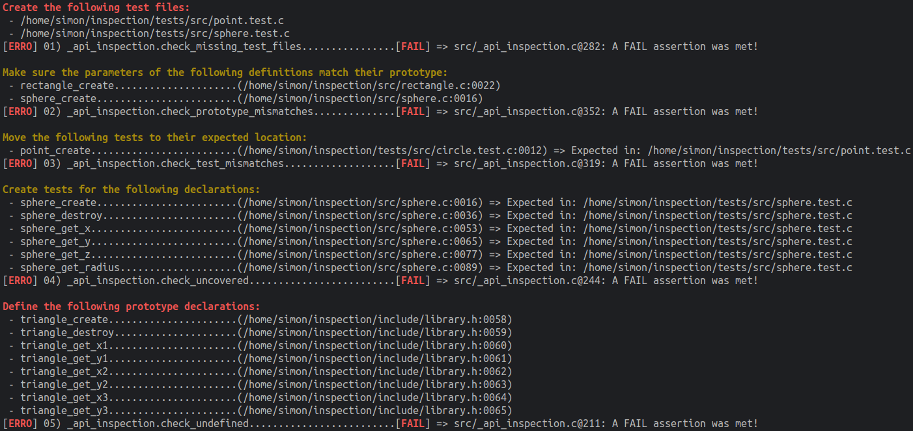

# CLove-Unit C Library Template

This template is equipped with a set of checks for unit testing and consistency checking. It is designed to integrate seamlessly
with [CLove-Unit](https://github.com/fdefelici/clove-unit/).

The inspection suite is built around the following rules that I have set up for my workflow:

1. Every API must be covered, either by annotations or a dedicated clove unit test.
2. Test names should reflect API function names. In cases of test variations, use double underscores  
   (e.g. "point_create," "point_create__on_null").
3. Test file names should mirror the corresponding implementation file names, ending with ".test.c" instead of ".c".
4. Each API prototype declaration must have a corresponding implementation.
5. Parameters in prototypes should match their definitions.

## Screenshot

## Project Structure

The root directory contains three main folders:

1. **Include folder:**
    - Contains a single header file that provides the API for the library and defines interfaces for external use.

2. **Source folder:**
    - Contains the essential source code files needed to implement the functionality of the library.

3. **Tests folder:**
    - Contains its own CMakeLists file, designed for inclusion rather than loading as a standalone project.
    - Dynamically fetches the latest version of `clove-unit.h` and places it in the `tests/vendor` folder, which is explicitly ignored by the
      in the `.gitignore` file.

## License

This template is provided under the [MIT License](LICENSE). You are free to use it, modify it, and distribute it as per your project's needs. Feel
free to replace the license with one that aligns better with your project requirements.

## Contribute

Contributions are welcome!  
If you have ideas for improving this template, feel free to create issues or submit pull requests.
